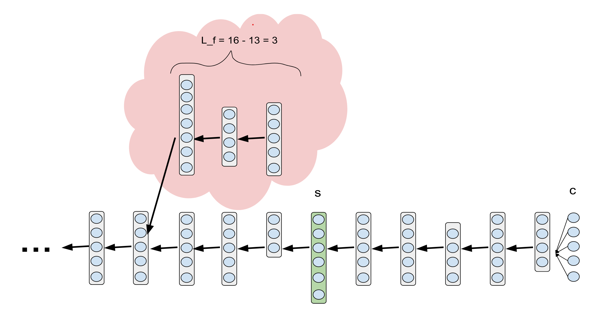
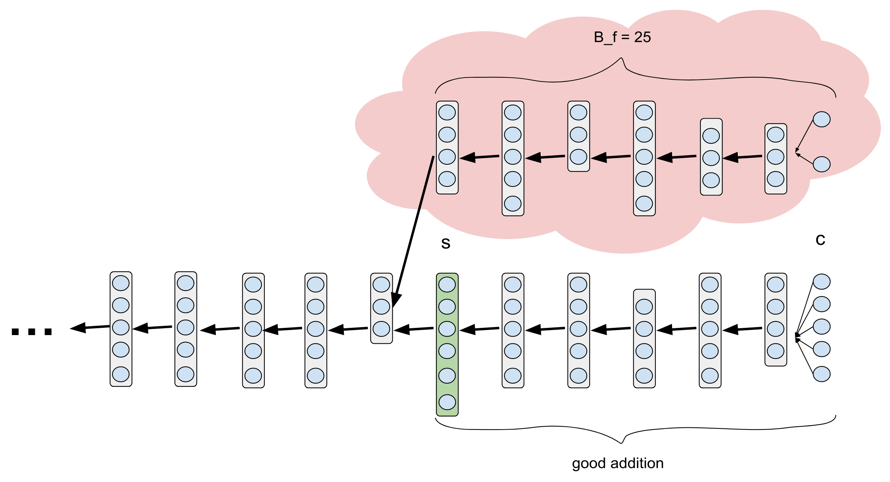
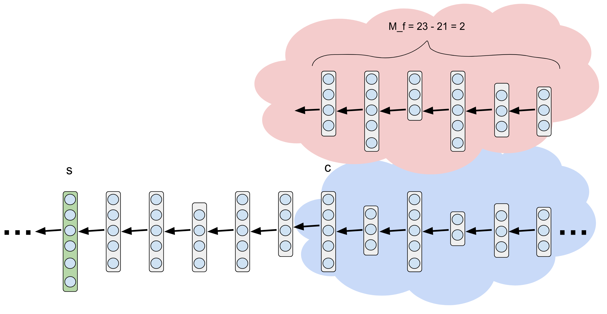
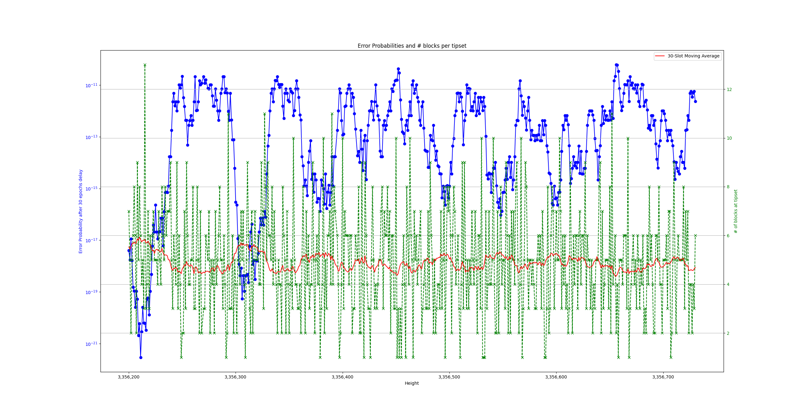
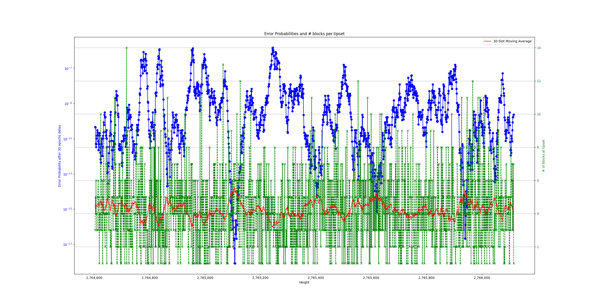

<!--You can leave these HTML comments in your merged FIP and delete the visible duplicate text guides, they will not appear and may be helpful to refer to if you edit it again. This is the suggested template for new FIPs. Note that a FIP number will be assigned by an editor. When opening a pull request to submit your FIP, please use an abbreviated title in the filename, `fip-draft_title_abbrev.md`. The title should be 44 characters or less.-->
This is the suggested template for new FIPs.

Note that a FIP number will be assigned by an editor. When opening a pull request to submit your FIP, please use an abbreviated title in the filename, `fip-draft_title_abbrev.md`.

The title should be 44 characters or less.

# A Finality Calculator for Filecoin

## Simple Summary
<!--"If you can't explain it simply, you don't understand it well enough." Provide a simplified and layman-accessible explanation of the FIP.-->
Instead of counting the number of epochs alone in order to measure the finality, we propose to also consider what has happened during those epochs whenever the information is available. For example, contemplate case A and case B. In case A, for the last 50 epochs the chain grew by 5 blocks per epoch on average, in line with expectation. In case B, on the other hand, for the last 50 epochs the chain grew by a mere 2 blocks per epoch. Clearly, the probability of a chain reconfiguration longer than 50 epochs is much smaller in case A than in case B.

## Abstract
<!--A short (~200 word) description of the technical issue being addressed.-->
We embark on an analysis of Filecoin's Finality, i.e., the probabilistic guarantees that a given tipset will always be in the canonical chain. The analysis involves distributed computing and stochastic arguments and provides upper bounds for the error probabilities, i.e., the probability that a reorg would overide a given tipset. We do so by using a dynamic evaluation which takes into account the specific obserevd history of the chain. Unlike a static analysis that considers the worst case conditions, we consider the worst case conditions in the (unknown) future but do not consider the worst case past. Instead, we use the obsereved chain to reason about the (known) past. The result is an algorithm that, given a specific chain history. provides an upper bound on the error probabilities. As an example, currently several key applications of Filecoin use a 900 epochs settelment period to provide a (hand wavey) finality guarantee of $2^{-30}$. Our analysis shows that in many cases upper bounding the error probability on $2^{-30}$ is achieved in 25~35 epochs -- a x30 improvement.

## Change Motivation
<!--The motivation is critical for FIPs that want to change the Filecoin protocol. It should clearly explain why the existing protocol specification is inadequate to address the problem that the FIP solves. FIP submissions without sufficient motivation may be rejected outright.-->
The motivation is two fold: 1) Providing theoretical guarantees for Filecoin that are based clear reasoning. 2) Reduce the delay times of using Filecoin.  We remark that the F3 finality gadjet will also adrress both of this points (with even faster finality times). However, this work provides several benefits in comparison to F3.
1. It requires no cahnge to lotus or any other code, and therefore no agreement process is needed. Instead, it is a simple algorithm that any node can run orthogonaly to the "mining process". The algorithm takes as input the obsereved history of from the node and outputs a measure of safety.
2. It does not change the incentive considerations of Filecoin, which remains a longest chain blockchain similarly to BTC and ETH. This is since no extra work is mandatory, the algorithm's execution (or no execution) does not affect the safety of Filecoin; it only provides a measure.
3. It is an algorithm and not a protocol. That is, the execution is local and the result does not depend on other nodes execution the algorithm as well.
4. It is infinitly scalable. It requires no additional communication what-so-ever.

Notablly, bullet (1) implies that our proposal can be used as an interim solution for Filecoin until F3 is deployed.

## Specification
<!--The technical specification should describe the syntax and semantics of any new feature. The specification should be detailed enough to allow competing, interoperable implementations for any of the current Filecoin implementations. -->
The analysis detailing how we bound the finality of a given input can be found [here](https://docs.google.com/document/d/1QpIpOLaabvieTrbgXzOSg3p1Z5SbNInGNqzBNFrCgXQ/edit#heading=h.c5olklehxrdn).

## Design Rationale
<!--The rationale fleshes out the specification by describing what motivated the design and why particular design decisions were made. It should describe alternate designs that were considered and related work, e.g. how the feature is supported in other languages. The rationale may also provide evidence of consensus within the community, and should discuss important objections or concerns raised during discussion.-->
The reasoning behind the upper bound of the error probabilities is based on:
* An assumption that a block $B_h$ that is produced by an honest miner (aka validator/SP) at epoch $r$ is visible to all other honest miners by the start of epoch $r+1$, and consequently, the branch that $B_h$ is building upon is also visible to the other miners by epoch $r+1$. This assumption is slightly weaker than the synchrony assumption typically used in Filecoin.
* Considering the adversarial possibilities according to different eras and assigning specific random variables to handle each era:
  1. Distant past -- adversarial lead building. Denoted $L_f$.
  2. Recent past -- competing chain construction building. Denoted $B_f$.
  3. Future -- adversarial overtaking if needed. Denoted $M_f$.
  Each era has different charectaristics that need to be addressed. After which the results are combined to get an upper bound on the probability of error. The images belew illustrate the different eras.

## Backwards Compatibility
<!--All FIPs that introduce backwards incompatibilities must include a section describing these incompatibilities and their severity. The FIP must explain how the author proposes to deal with these incompatibilities. FIP submissions without a sufficient backwards compatibility treatise may be rejected outright.-->
No backward compatibility issues since what we suggest is pure analysis with no change to the existing Consensus mechanism. The analysis does rely on the Consistent Broadcast fix that was added after [FIPxxx](add link)

## TODO Test Cases
<!--Test cases for an implementation are mandatory for FIPs that are affecting consensus changes. Other FIPs can choose to include links to test cases if applicable.-->
We have run our analysis algorithm on past data from Filecoin. The periods analyzed are heights 3,356,200 to 3,356,700 which represent a typical healthy state, and heights 2,764,600 to 2,766,000 which was a less healthy period for Filecoin. The figures below show the results of quantifying the finality of tipsets after 30 epochs delay. (We note that one may choose other questions to analyze, such as, when does a specific tipset reach a given finality threshold?) The potential adverserial power we considered is 30%.

The figure below shows the results of applying the analysis on a typical healthy chain period --- tipset are almost full (5 blocks) on average. On the $x$-axis we have the epoch numbers. We have a double $y$-axis: on the right (in green) we have number of blocks, and on the left (in blue) we have error probabilities. The blue plot shows the error probability of the tipset at height $x$ after 30 epochs delay. One can see that it is mostly below $10^{-10}$, implying that a reorg of this tipset is a "once in 10,000 years" event.  The green plot shows the number of blocks in the tipset at height $x$.  Lastly, to better illustrate the correlation between the obsereved history and the error probability, the red plot shows the average number of blocks per epoch in the 30 epochs after $x$. It is eveident how a higher number of average blocks per epoch typically results in better finality measurement (smaler error probability).

The figure below shows the results of applying the analysis on a period when the Filecoin blockchain was less healthy (around the end of March 2023). Notably the tipset are less than full on average --- often falling to below 4 blocks per tipset on a 30 epochs' average. The plots and axis are analogous to before. Evidently, the finality measurement is worse than in the typical "ggod case". That is the error probabilities are higher in orders of magnitude in many cases.

## Security Considerations
<!--All FIPs must contain a section that discusses the security implications/considerations relevant to the proposed change. Include information that might be important for security discussions, surfaces risks and can be used throughout the life cycle of the proposal. E.g. include security-relevant design decisions, concerns, important discussions, implementation-specific guidance and pitfalls, an outline of threats and risks and how they are being addressed. FIP submissions missing the "Security Considerations" section will be rejected. A FIP cannot proceed to status "Final" without a Security Considerations discussion deemed sufficient by the reviewers.-->
All FIPs must contain a section that discusses the security implications/considerations relevant to the proposed change. Include information that might be important for security discussions, surfaces risks and can be used throughout the life cycle of the proposal. E.g. include security-relevant design decisions, concerns, important discussions, implementation-specific guidance and pitfalls, an outline of threats and risks and how they are being addressed. FIP submissions missing the "Security Considerations" section will be rejected. A FIP cannot proceed to status "Final" without a Security Considerations discussion deemed sufficient by the reviewers.

## Incentive Considerations
<!--All FIPs must contain a section that discusses the incentive implications/considerations relative to the proposed change. Include information that might be important for incentive discussion. A discussion on how the proposed change will incentivize reliable and useful storage is required. FIP submissions missing the "Incentive Considerations" section will be rejected. An FIP cannot proceed to status "Final" without a Incentive Considerations discussion deemed sufficient by the reviewers.-->
All FIPs must contain a section that discusses the incentive implications/considerations relative to the proposed change. Include information that might be important for incentive discussion. A discussion on how the proposed change will incentivize reliable and useful storage is required. FIP submissions missing the "Incentive Considerations" section will be rejected. An FIP cannot proceed to status "Final" without a Incentive Considerations discussion deemed sufficient by the reviewers.

## Product Considerations
<!--All FIPs must contain a section that discusses the product implications/considerations relative to the proposed change. Include information that might be important for product discussion. A discussion on how the proposed change will enable better storage-related goods and services to be developed on Filecoin. FIP submissions missing the "Product Considerations" section will be rejected. An FIP cannot proceed to status "Final" without a Product Considerations discussion deemed sufficient by the reviewers.-->
All FIPs must contain a section that discusses the product implications/considerations relative to the proposed change. Include information that might be important for product discussion. A discussion on how the proposed change will enable better storage-related goods and services to be developed on Filecoin. FIP submissions missing the "Product Considerations" section will be rejected. An FIP cannot proceed to status "Final" without a Product Considerations discussion deemed sufficient by the reviewers.

## Implementation
<!--The implementations must be completed before any core FIP is given status "Final", but it need not be completed before the FIP is accepted. While there is merit to the approach of reaching consensus on the specification and rationale before writing code, the principle of "rough consensus and running code" is still useful when it comes to resolving many discussions of API details.-->
An algorithm that computes the aforementioned bound is drafted in python [here](https://github.com/guy-goren/ECFinalityCalculator/blob/master/validator_calc_finality.py).

## TODO
<!--A section that lists any unresolved issues or tasks that are part of the FIP proposal. Examples of these include performing benchmarking to know gas fees, validate claims made in the FIP once the final implementation is ready, etc. A FIP can only move to a “Last Call” status once all these items have been resolved.-->
If nobody wishes to implement the algorithm computing the finality, and would rather use the existing python script, then some parts should be improved:
1. Running time. The Python script I wrote is quite slow.
2. Edge cases. Adding a constant as an input representing the maximal _obsereved_ competing chain.
   
## Copyright
Copyright and related rights waived via [CC0](https://creativecommons.org/publicdomain/zero/1.0/).
